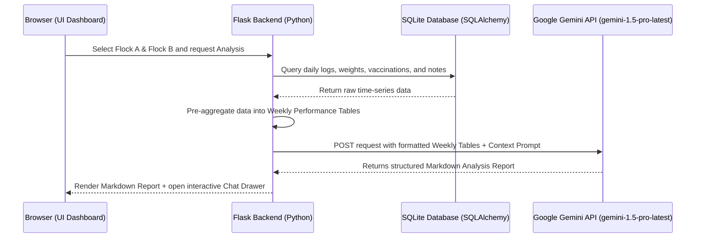

# WebApp AI - Futuristic Poultry ERP AI Integration Guide

This document serves as the master reference guide and engineering specification for incorporating **Gemini AI capabilities** into the SLH-OP Web Application. It contains complete implementation plans, technical instructions, database aggregation strategies, prompting schemas, and future-ready architectures.

---

## 🎯 1. Core Integration Goals

The primary goal is to establish a secure, server-side, zero-dependency AI engine that enhances data analysis and assists users in managing breeder flocks more efficiently.

1. **Comparative Flock Analytics:** Enable users to select any historical (past) flock and a new/active flock, performing side-by-side behavioral, mortality, and productivity analysis.
2. **Conversational Assistant:** Provide an interactive, context-aware chatbot capable of answering complex follow-up questions using live and historical performance logs.
3. **Hands-Free Voice logging:** Empower workers to record daily operations hands-free via spoken audio dictated directly to the browser, parsed automatically by Gemini.
4. **Multi-Modal Visual Diagnostics:** Support visual inspections by letting workers snap and upload pictures of symptoms or logs to the AI chat for real-time analysis.
5. **Proactive Health Forecasts:** Implement background analyzers to spot early-stage disease patterns or feed/water intake anomalies before they escalate.

---

## 🛠️ 2. Architectural Blueprint & Data Flow



---

## 💾 3. Data Serialization & Prompting Schemas

To minimize token consumption and maximize analytical quality, the Flask backend must serialize raw database values into a structured Markdown format prior to querying Gemini.

### A. Weekly Aggregation Format (Markdown Table)
The backend should compile the daily logs for each selected flock into weekly records with the following columns:
```markdown
| Bio Week | Female Mortality (rate %) | Male Mortality (rate %) | Avg Female Feed (g/b) | Avg Male Feed (g/b) | Water/Feed Ratio | Laying Rate (%) | Avg BW Female (g) | Uniformity Female (%) | Clinical Notes Summary |
|----------|---------------------------|-------------------------|-----------------------|---------------------|------------------|-----------------|-------------------|-----------------------|------------------------|
| Week 22  | 0.05% (cumulative 0.12%)  | 0.08% (cumulative 0.18%) | 120g                  | 135g                | 1.82             | 5.2%            | 2100g             | 74.0%                 | Mild heat stress noted |
| Week 23  | 0.04% (cumulative 0.16%)  | 0.06% (cumulative 0.24%) | 122g                  | 138g                | 1.85             | 12.8%           | 2180g             | 75.5%                 | Normal behavior        |
```

### B. Standard Gemini System Instruction
```text
You are a senior poultry consultant specializing in Arbor Acres Plus S broiler breeder flocks at Sin Long Heng Breeding Farm.
You will be provided side-by-side weekly performance tables of two breeder flocks (Flock A - Historical vs. Flock B - Current).
Your role is to perform rigorous time-series comparative analysis.

Evaluate and report on:
1. Laying Curve Alignment: Compare the onset, peak, and post-peak persistency of egg laying against breeder standards.
2. Feed Conversion & Growth: Analyze bodyweight gains vs. daily feed allowances. Assess if feed increments were aligned with uniformity.
3. Behavioral and Resource Anomalies: Review Water-to-Feed ratio deviations and correlate them with mortality or culling spikes.
4. Qualitative Corroboration: Integrate Clinical Notes (such as temperature fluctuations, medication periods) to explain drops or peaks.

Structure your response into 4 distinct Markdown sections:
- Executive Summary (1 paragraph highlighting the key differences)
- Comparative Performance Metrics (Deep-dive into Egg lay %, Feed/BW, and Mortality)
- Anomaly & Risk Detection (Pinpoint weeks showing abnormal resource intake or spikes)
- Actionable Management Steps (3 high-priority, practical recommendations)
```

---

## 💻 4. Step-by-Step Implementation Guide

Follow these steps directly to integrate the AI Analytics Dashboard when ready.

### Step 1: Implement the Data Aggregator in Python
Add a helper method in `app/services/data_service.py` to fetch and format breeder flock metrics weekly:
```python
def get_flock_weekly_performance_data(flock_id):
    flock = Flock.query.get_or_404(flock_id)
    logs = DailyLog.query.filter_by(flock_id=flock.id).order_by(DailyLog.date.asc()).all()
    # Enrich logs using metrics.py enrich_flock_data
    from metrics import enrich_flock_data
    enriched = enrich_flock_data(flock, logs)
    
    # Group enriched records into biological weeks (age_weeks)
    # Calculate averages/sums for feed, water, mortality, laying rate, and append clinical notes
    # Return formatted Markdown string
```

### Step 2: Register AI API Endpoints
In `app/routes/api.py`, register secure Python backend API routes utilizing raw `requests` calls:
```python
@app.route('/api/ai/compare', methods=['POST'])
@login_required
def api_ai_compare():
    data = request.get_json()
    flock_id_1 = data.get('flock_id_1') # Historical
    flock_id_2 = data.get('flock_id_2') # Current
    
    # 1. Fetch weekly markdown summaries
    table_1 = get_flock_weekly_performance_data(flock_id_1)
    table_2 = get_flock_weekly_performance_data(flock_id_2)
    
    # 2. Build Gemini prompt
    api_key = os.getenv('GEMINI_API_KEY')
    url = f"https://generativelanguage.googleapis.com/v1beta/models/gemini-1.5-pro-latest:generateContent?key={api_key}"
    
    prompt = f"Perform side-by-side comparison between Flock 1 (Historical) and Flock 2 (Current):\n\nFlock 1 Data:\n{table_1}\n\nFlock 2 Data:\n{table_2}"
    
    payload = {
        "contents": [{"parts": [{"text": prompt}]}],
        "generationConfig": {
            "temperature": 0.2
        }
    }
    
    response = requests.post(url, json=payload, timeout=30)
    result = response.json()
    reply = result['candidates'][0]['content']['parts'][0]['text']
    
    return jsonify({"success": True, "report": reply})
```

### Step 3: Implement Dashboard View Routing
Register the user-facing view inside `app/routes/health.py`:
```python
@app.route('/breeder/ai-insights', methods=['GET'])
@login_required
@dept_required(['Breeder', 'Management'])
def breeder_ai_insights():
    # Fetch historical flocks (Inactive) and new flocks (Active)
    historical_flocks = Flock.query.filter_by(status='Inactive').order_by(Flock.intake_date.desc()).all()
    current_flocks = Flock.query.filter_by(status='Active').order_by(Flock.intake_date.desc()).all()
    return render_template('ai_insights.html', historical=historical_flocks, current=current_flocks)
```

### Step 4: Create the Dashboard Template (`ai_insights.html`)
Design a high-fidelity, environment-aware dashboard inside `app/templates/ai_insights.html`. 
- **Tabler Grid System:** Use `.row`, `.col-md-4` for selectors and `.col-md-8` for report display.
- **Visual Feedback:** Incorporate an interactive loading animation during fetching:
  ```html
  <div id="loader" class="spinner-border text-primary" role="status" style="display:none;"></div>
  ```
- **Interactive Chat Panel:** Add a side-drawer (`.offcanvas-end` in Bootstrap 5) styled with HSL harmonized theme variables to act as the floating AI Assistant chat widget.

---

## 🚀 5. Futuristic AI User Experience Add-ons

For a highly advanced, next-generation operational experience, plan these integrations:

### A. Hands-Free Voice Dictation & Auto-Form Parsing
- **Concept:** Barn workers walking inside the houses can record daily data hands-free.
- **Workflow:**
  1. Frontend captures audio using HTML5 MediaRecorder API.
  2. Spoken audio is sent to the backend `/api/ai/voice-entry` endpoint.
  3. The backend passes the audio payload to Gemini's multi-modal audio input with instructions to parse numbers.
  4. Gemini returns structured JSON:
     ```json
     {
       "female_mortality": 3,
       "male_mortality": 1,
       "feed_female_gp_bird": 145,
       "clinical_notes": "Birds look active, slightly noisy ventilation."
     }
     ```
  5. The Flask backend automatically populates the form input fields in the UI.

### B. Multi-Modal Visual Symptom Diagnosis
- **Concept:** Instant visual validation of anomalies (e.g. wet litter, abnormal culls, respiratory symptoms).
- **Workflow:**
  1. A camera button inside the AI Assistant Chat lets users take pictures using their smartphone.
  2. The image is sent inline with the chat prompt to Gemini 1.5 Pro.
  3. Gemini identifies visual signs (e.g. wet litter compaction, specific skeletal lesions in culls) and suggests immediate operational remedies while logging the clinical event in the flock's history.

### C. Proactive Background Anomaly Forecasting
- **Concept:** Instead of waiting for a manual query, an autonomous worker analyzes daily entries in the background.
- **Workflow:**
  1. A nightly Celery cron job runs `/api/ai/health-scan`.
  2. It evaluates cumulative mortality trajectories and water intake.
  3. If a current flock's Week 26 water intake mimics the pre-disease onset pattern of a historical flock from 2024, it triggers a push notification:
     ```text
     "Warning: Flock House 3 shows a 4% feed-to-water ratio drop, matching historical coccidiosis onset signature."
     ```
