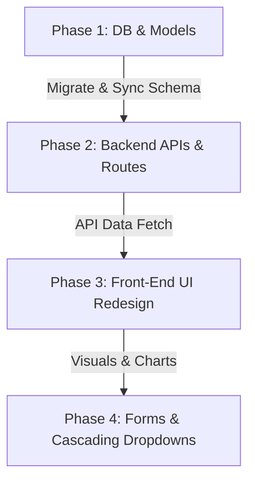

# Implementation Plan — Broiler Operations & Dashboard Upgrade

This document outlines a comprehensive, premium upgrade plan for the **Broiler Operational Department** within the SLH-OP system. The goal is to bring the Broiler UI/UX up to the standards of the Breeder department, enforce strict facility relations, implement archival for harvested flocks, and introduce a multi-house comparison chart.

---

## 📅 Architectural Goals & Alignment

1. **Facilities Reference Integration**: Migrate the `BroilerFlock` model from flat `farm_name`/`house_name` string fields to direct relationships (`farm_id` ➔ `Farm`, `house_id` ➔ `House`) mapping to the standard multitenant facilities setup.
2. **Archival & Separation (Lifecycle Management)**: Implement a clean "Harvested/Archived" lifecycle state so completed flocks are moved out of the active dashboard to a dedicated historical tab.
3. **Multi-House Performance Comparison**: Since broiler farms operate on an **All-In, All-Out** schedule, implement a multi-line comparison chart plotting metrics (Bodyweight, FCR, Mortality) across age days for all active houses under the selected farm in a single Chart.js container.
4. **Breeder UI/UX Parity**: Introduce premium Tabler-style KPI cards, dark-mode adaptive layouts, and an interactive grid interface.

---

## 🛠️ Step-by-Step Execution Plan



### 🗄️ Phase 1: Database Schema & Facilities Refactoring

#### 1. Update Models (`app/models/models.py`)
Add `farm_id`, `house_id`, and harvest details to `BroilerFlock`:

```python
class BroilerFlock(db.Model):
    id = db.Column(db.Integer, primary_key=True)
    farm_id = db.Column(db.Integer, db.ForeignKey('farm.id'), nullable=False, index=True)
    house_id = db.Column(db.Integer, db.ForeignKey('house.id'), nullable=False, index=True)
    
    # Retain name fields as fallbacks
    farm_name = db.Column(db.String(100), nullable=True)
    house_name = db.Column(db.String(100), nullable=True)
    
    source = db.Column(db.String(100), nullable=True)
    breed = db.Column(db.String(50), nullable=True)
    intake_birds = db.Column(db.Integer, default=0, nullable=False)
    intake_date = db.Column(db.Date, nullable=False, default=date.today)
    arrival_weight_g = db.Column(db.Float, default=0.0)
    is_active = db.Column(db.Boolean, default=True, index=True)
    
    # Harvesting details
    harvest_date = db.Column(db.Date, nullable=True)
    harvested_birds = db.Column(db.Integer, nullable=True)
    harvest_fcr = db.Column(db.Float, nullable=True)
    harvest_avg_weight = db.Column(db.Float, nullable=True)

    # Relationships
    farm = db.relationship('Farm', backref='broiler_flocks', lazy=True)
    house = db.relationship('House', backref='broiler_flocks', lazy=True)
    logs = db.relationship('BroilerDailyLog', backref='flock', lazy=True, cascade="all, delete-orphan")
```

#### 2. Create Self-Healing Migrations
Create a defensive Alembic migration file `XXXX_upgrade_broiler_flock_facilities.py` that:
- Inspects `broiler_flock` using SQLAlchemy `Inspector`.
- Adds `farm_id` (ForeignKey), `house_id` (ForeignKey), `harvest_date`, and other new columns if they do not exist.
- Performs a data sync mapping the string `farm_name` and `house_name` of existing flocks to matching `Farm` and `House` records in the database, defaulting to `farm_id = 1` if no matches are found.

---

### ⚙️ Phase 2: Route & Logic Upgrades

#### 1. Update operational routes (`app/routes/broiler.py`)
- **Dashboard route (`/broiler/dashboard`)**:
  - Filter active flocks: `BroilerFlock.query.filter_by(is_active=True).all()`.
  - Filter harvested flocks: `BroilerFlock.query.filter_by(is_active=False).order_by(BroilerFlock.harvest_date.desc()).all()`.
  - Retrieve the user's accessible Farms lists using facilities configuration.
- **Harvest route (`/broiler/flock/<id>/harvest`, POST)**:
  - Create a route to complete a flock. It marks `is_active = False` and saves harvest date, harvested birds count, and final calculations.

#### 2. Implement the All-In, All-Out Multi-House Metric Compare API
Create a new API route `/api/broiler/compare_metrics` in `app/routes/api.py`:
- **Parameters**: `farm_id` (int), `metric` (`body_weight_g`, `fcr`, `mortality_pct`).
- **Logic**:
  1. Fetch all active broiler flocks matching the `farm_id`.
  2. For each active flock, call `calculate_broiler_metrics(flock.id)`.
  3. Map daily metrics by age day (`day_number`), plotting data points for each house.
  4. Fetch standard reference data from `BroilerStandard`.
  5. Return a payload in this format:
     ```json
     {
       "days": [1, 2, 3, ..., 40],
       "standards": [0.09, 0.12, ..., 1.65],
       "series": {
         "House A": [0.08, 0.11, ..., 1.70],
         "House B": [0.09, 0.13, ..., 1.62]
       }
     }
     ```

---

### 🎨 Phase 3: Premium UI/UX Dashboard Redesign

Redesign the broiler dashboard [broiler_dashboard.html](file:///workspaces/erpslh/app/templates/broiler/broiler_dashboard.html) utilizing premium Tabler layout styles.

#### 1. Sleek Tab Interface
- **Tab 1: Active Operations**:
  - Left panel / Top row: Farm selector dropdown, Active KPI cards (Total Active Birds, Total Feed Consumed, Active Houses).
  - Center block: The **Multi-House Performance Comparison Chart**.
  - Lower block: Clean, tabulated active flocks grid.
- **Tab 2: History & Harvests**:
  - Archives table showing historical flocks, harvest date, final weight, final FCR, and total depletion (mortality) rates.

#### 2. The Multi-House Chart.js Integration
Implement a premium, responsive Chart.js canvas:
- Listens to system-wide theme changes (`themeChanged` window event) to dynamically toggle grid/text colors.
- Implements Y-axis buffer max (1.1x the maximum dataset value) for clean presentation spacing.
- Metric toggles (Bodyweight, FCR, Mortality) to fetch and draw the corresponding comparison series on the fly.

---

### 📝 Phase 4: Cascading Facility Selection Forms

Update [broiler_new_flock.html](file:///workspaces/erpslh/app/templates/broiler/broiler_new_flock.html) and daily entry forms:
1. **Dynamic Dropdowns**: Replace manual text inputs for Farm and House with cascading dropdown select lists.
2. **JavaScript Integration**: Use standard fetch calls to `/api/houses_by_farm/<farm_id>` to reload the House dropdown dynamically as the user changes the Farm dropdown.

---

## 📈 Quality Assurance & Validation Gating

1. **Regression Suite**: Ensure `python -m pytest tests/` continues to pass cleanly (7/7 tests) before and after database migrations are applied.
2. **Defensive Migration Test**: Validate SQLite column injection checks defensively by upgrading staging database mock runs.
3. **UX Validation**: Verify correct styling in dark mode using `data-bs-theme="dark"` styling controls.
