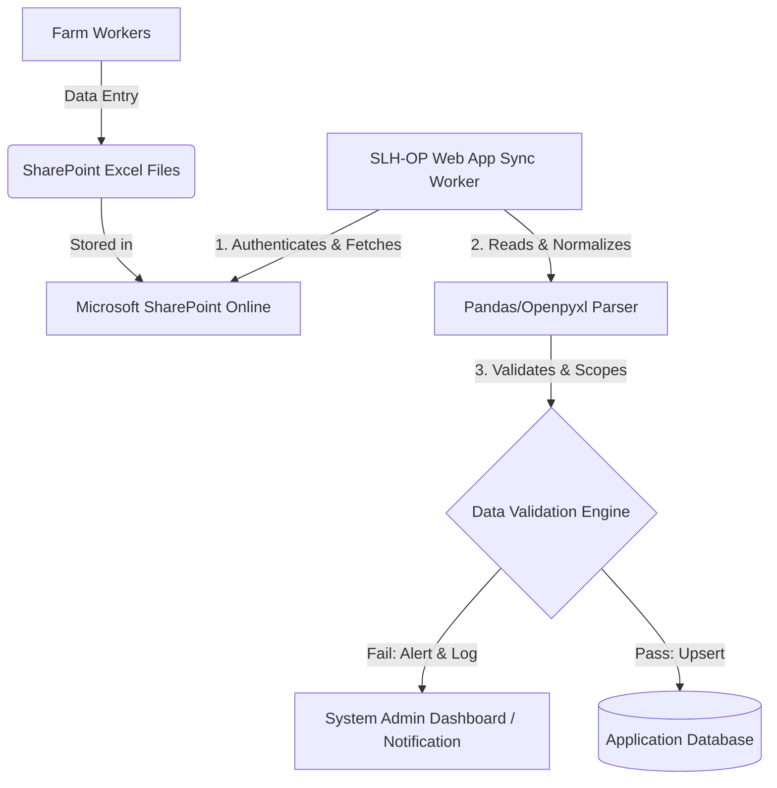

# SharePoint Excel Integration Plan: Automated Daily Log Synchronization

This document outlines the architecture, data processing pipeline, error-handling strategies, and simulation scenarios to automatically extract daily farm log entries from Excel files stored on Microsoft SharePoint and synchronize them with the SLH-OP web application.

---

## 1. System Architecture Overview

The integration establishes an automated bridge between the farm workers' comfortable offline spreadsheet data entry in SharePoint and the central Flask database.



---

## 2. SharePoint Authentication & Connection Blueprint

To access the files programmatically and securely, we utilize the **Microsoft Graph API** using the **OAuth 2.0 Client Credentials Flow**. This avoids user-interactive logins by utilizing an application registration in Azure AD.

### 2.1 Azure Active Directory Setup
1. **App Registration**: Register `SLH-OP-Sync-Service` in Azure Active Directory (Microsoft Entra ID).
2. **API Permissions (Application Permissions)**:
   - `Files.Read.All` or `Sites.Read.All` (restricted via SharePoint Site Permissions to only target directories).
3. **Credentials**: Generate a **Client Secret** or upload a certificate.

### 2.2 Extraction Protocol using MSAL (Python)
The sync service uses `msal` (Microsoft Authentication Library) to acquire an access token, which is then passed as an Authorization header to Microsoft Graph API endpoints.

```python
import msal
import requests

def get_sharepoint_token(client_id, tenant_id, client_secret):
    authority = f"https://login.microsoftonline.com/{tenant_id}"
    app = msal.ConfidentialClientApplication(client_id, authority=authority, client_secret=client_secret)
    result = app.acquire_token_for_client(scopes=["https://graph.microsoft.com/.default"])
    return result.get("access_token")
```

---

## 3. Data Processing & Validation Pipeline

Once the raw spreadsheet bytes are fetched via Graph API, the system passes them through a structured ingestion engine.

### 3.1 Step-by-Step Data Flow
1. **Schedule Trigger**: An active background worker (e.g. `APScheduler` or a cron task) triggers every hour or at midnight.
2. **File Fetch**: The service fetches the Excel file from the target SharePoint library path.
3. **Data Parsing**: `pandas` reads the Excel worksheets in-memory without storing temporary local files.
4. **Target Matching**: The system parses the sheets to resolve central facilities. It maps `Farm` and `House` names in the Excel headers to their database foreign keys.
5. **Database Upsert**: The entries are compared against existing database logs to ensure there are no duplicate entries.

---

## 4. Scenario Simulations & Failure Resolution

Here we simulate real-world scenarios, how the synchronization worker will react, and how the app handles anomalies.

| Scenario | Trigger / Cause | System Reaction | Resolution Strategy |
| :--- | :--- | :--- | :--- |
| **A. Clean Synchronization** | The worker completes day 12 entry correctly in Excel. | Reads rows, passes validation, checks database for Day 12. | Inserts new `BroilerDailyLog` row. Web charts reflect new metrics. |
| **B. Data Overlap / Duplicate Day** | Worker edits Day 11 row in Excel that was already imported. | Identifies existing log in database matching the date and house. | **Upsert Strategy**: Updates the existing database row with the new Excel values (e.g. corrected mortality counts). |
| **C. Invalid Data Input** | Worker inputs a string (e.g., `"Ten"`) in the `Death Count` column. | `Pandas` fails numerical parsing. | Rejects the row, logs the line error, and sends a notification to the manager. Sync continues for valid rows. |
| **D. Missing/Incorrect House Mapping** | Worker enters `"House 9"` which does not exist in the DB setup. | Facilities resolver fails to find the house. | Skips ingestion of the entire sheet. Fires a "Facility Not Found" alert on the dashboard. |
| **E. Template Schema Drift** | Worker deletes or renames a key column (e.g., renames `remarks` to `notes`). | Column presence check fails in the ingestion script. | Aborts the task immediately. Sends a "Template Version Conflict" email notification to the administrator. |
| **F. Network / Token Timeout** | SharePoint API returns a `401 Unauthorized` or `503 Temporary Gateway Timeout`. | Graph client catches requests exceptions. | Retries up to 3 times with exponential backoff before marking the sync run as `Failed` in the logs. |

---

## 5. Detailed Code Blueprint

Below is the design for the core synchronization service `app/services/sharepoint_sync.py`:

```python
import pandas as pd
from datetime import datetime
from app.database import db
from app.models.models import BroilerFlock, BroilerDailyLog, Farm, House

class SharePointSyncService:
    @staticmethod
    def sync_excel_to_db(excel_bytes):
        # 1. Read sheet in-memory
        df = pd.read_excel(excel_bytes, sheet_name="Daily Logs")
        
        # 2. Basic schema validation
        required_cols = ["Date", "Farm", "House", "Death Count", "Feed Daily Use (kg)", "Body Weight (g)"]
        for col in required_cols:
            if col not in df.columns:
                raise ValueError(f"Required column '{col}' is missing in Excel template.")

        records_synced = 0
        
        # 3. Process Row-by-Row
        for idx, row in df.iterrows():
            date_val = row["Date"]
            farm_name = str(row["Farm"]).strip()
            house_name = str(row["House"]).strip()
            
            # Resolve facilities
            farm = Farm.query.filter(Farm.name.ilike(farm_name)).first()
            house = House.query.filter(House.name.ilike(house_name), House.farm_id == getattr(farm, 'id', None)).first()
            
            if not farm or not house:
                print(f"Row {idx}: Facility mismatch skipped. Farm: {farm_name}, House: {house_name}")
                continue
                
            # Locate active flock
            flock = BroilerFlock.query.filter_by(farm_id=farm.id, house_id=house.id, is_active=True).first()
            if not flock:
                print(f"Row {idx}: No active flock in {farm_name} - {house_name}. Skipped.")
                continue

            # Parse logs safely
            try:
                log_date = pd.to_datetime(date_val).date()
                death_count = int(row["Death Count"]) if pd.notna(row["Death Count"]) else 0
                feed_use = float(row["Feed Daily Use (kg)"]) if pd.notna(row["Feed Daily Use (kg)"]) else 0.0
                body_weight = float(row["Body Weight (g)"]) if pd.notna(row["Body Weight (g)"]) else 0.0
                remarks = str(row["Remarks"]) if ("Remarks" in df.columns and pd.notna(row["Remarks"])) else ""
            except (ValueError, TypeError) as e:
                print(f"Row {idx}: Data format error ({str(e)}). Skipped.")
                continue

            # Calculate life days
            day_number = (log_date - flock.intake_date).days + 1

            # 4. Upsert (Insert-or-Update) Strategy
            existing_log = BroilerDailyLog.query.filter_by(flock_id=flock.id, date=log_date).first()
            
            if existing_log:
                # Update existing values
                existing_log.day_number = day_number
                existing_log.death_count = death_count
                existing_log.feed_daily_use_kg = feed_use
                existing_log.body_weight_g = body_weight
                existing_log.remarks = remarks
            else:
                # Insert new log record
                new_log = BroilerDailyLog(
                    flock_id=flock.id,
                    date=log_date,
                    day_number=day_number,
                    death_count=death_count,
                    feed_daily_use_kg=feed_use,
                    body_weight_g=body_weight,
                    remarks=remarks
                )
                db.session.add(new_log)
                
            records_synced += 1

        db.session.commit()
        return records_synced
```

---

## 6. Worker Scheduling Strategy

To trigger this process automatically without requiring manual dashboard clicks, we integrate a scheduler task:

1. **APScheduler Task**: Define a background job running inside Flask.
2. **Cron Job Schedule**: Trigger every night at `02:00 AM` to capture all data entered by workers during the previous day.
3. **Manual Trigger**: Provide an "Import from SharePoint" button in the admin control panel for on-demand synchronization runs.
